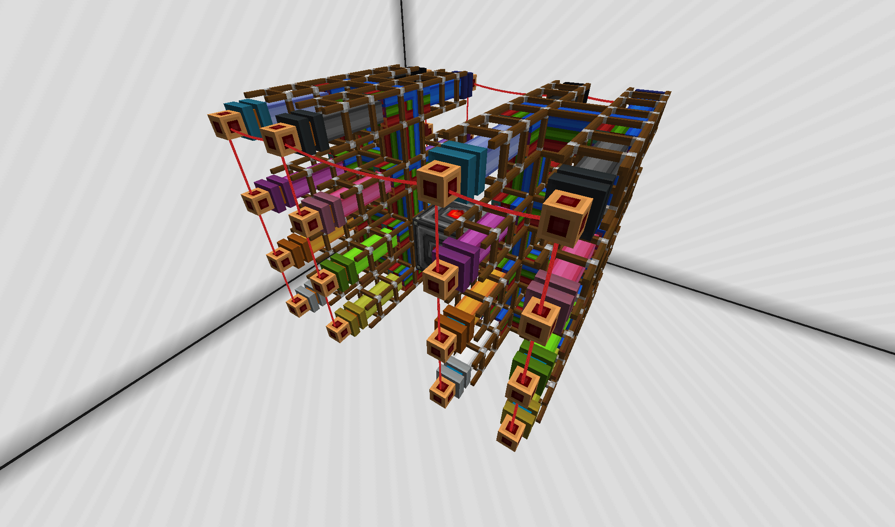
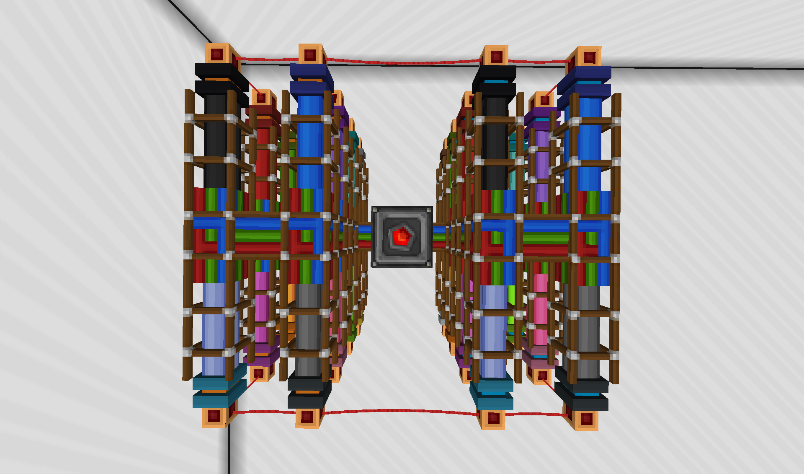
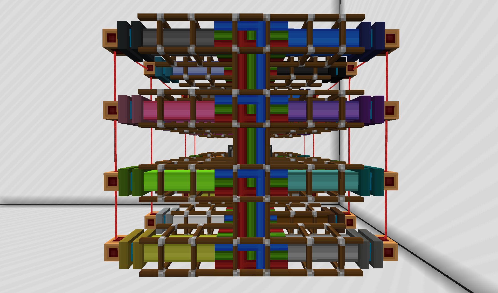
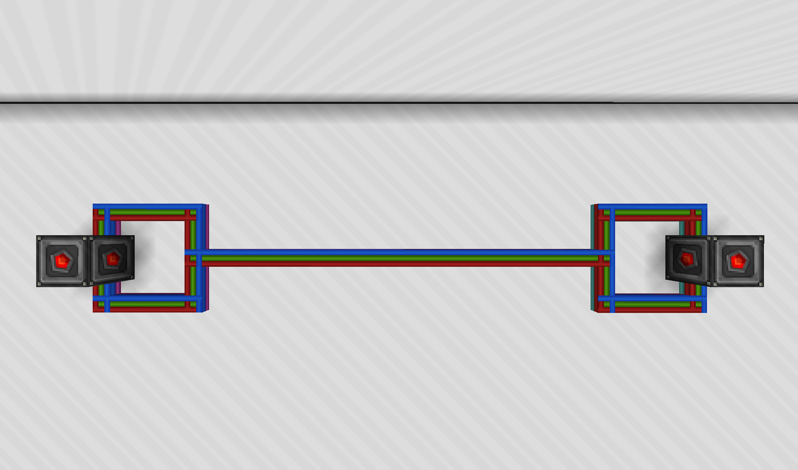

# RSRT

The **R**edstone **S**ynchronous **R**eceiver **T**ransmitter is designed to relay arbitrary messages over a lossless analog redstone connection. It is intended for half-duplex buses, where telegrams are distributed to all connected receivers on a best-effort basis without flow control. Despite its simplified design, it supports variable bandwidth and rudimentary medium access control.

- [RSRT](#rsrt)
  - [Hardware](#hardware)
    - [Wiring](#wiring)
      - [Bidirectional](#bidirectional)
      - [Fan-out](#fan-out)
      - [Direct](#direct)
    - [Device](#device)
  - [Protocol](#protocol)
    - [Parallel bits](#parallel-bits)
    - [Synchronous clock](#synchronous-clock)
    - [Start and end detection](#start-and-end-detection)
    - [Collision detection](#collision-detection)
    - [Reading and writing](#reading-and-writing)
    - [Line coding](#line-coding)
    - [Plug-and-play](#plug-and-play)
    - [Error handling](#error-handling)
      - [Channel count mismatch](#channel-count-mismatch)
    - [Performance](#performance)
      - [Speed](#speed)
      - [Errors](#errors)
- [Appendix](#appendix)
  - [*ProjectRed* quantization.](#projectred-quantization)
  - [Standard fan-out](#standard-fan-out)
  - [Direct coupling](#direct-coupling)

> The document describes the design specification and the reference implementation of the protocol. Any detail of the implementation can be adjusted or substituted depending on the intended use case. In these cases, not all notes and limitations may apply to the overall system.

## Hardware

This section briefly describes the basic hardware requirements for **RSRT** buses.

### Wiring

**RSRT** is designed to run on lossless analog redstone, which means that signals have to be coupled without loss of information (signal strength) between endpoints. This requirement is inherently fulfilled by *Immersive Engineering* redstone connectors, but can also be achieved using other strategies, such as [quantization and reamplification](#projectred-quantization) using *ProjectRed* redstone wiring.

To simplify the implementation, *ProjectRed* bundled connections are *required* as inputs and outputs for **RSRT** transcievers. The user may then convert (i.e. using fan-out) to another wire medium, like *Immersive Engineering* redstone wiring.

#### Bidirectional

Since **RSRT** is intended for buses, the connection must be bidirectional on all channels. This is not a strict requirement of the protocol, since no continuous collision detection is used during sending, however the first channel *must* be bidirectional to allow for medium access control.

Because *Immersive Engineering* and other potential fan-out will introduce a saturating feedback loop if short-circuited at any end of the connection, the standard **RSRT** transciever spatially seperates the RX from the TX bundle. The signals of both may then be combined on the wire, i.e using duplicated fan-out.

#### Fan-out

The use of *Immersive Engineering* redstone connectors is greatly encouraged. Transmission of a full 16-channel **RSRT** connection can be facilitated using only one such wire over arbitrary distances without special requirements to wire design or chunkloading along the path (except endpoints).

Because of the hard distance requirement on bundled cables, however, only few [fan-out designs](standard-fan-out) are viable. The rule of thumb is to attach channel wires ending in connectors to a plane of bundled wire, which is connected to the redstone I/O near its center. A full 16-channel fan-out requires two such planes of size 2x4 (for TX and RX), with both sides having connectors attached.

> Connectors for input and output *must not* be directly adjacent, because they will interfere with each other.

#### Direct

Reffered to as "direct", two transcievers can also be [coupled directly](#direct-coupling) via bundled cables. The hard distance requirement on the cabling as well as bidirectionality must be met here as well, making direct connections feasible only over short distances.

### Device

**RSRT** devices usually fit into one of these three categories:

1. Dedicated relay
   
   A dedicated device running an **RSRT** driver together with a simple network-based interface to implement an excplicit message relay over **RSRT** to bridge existing *OC* networks.

   According to some different network-based protocol, messages read on the wire are sent to the network, and vice-versa.

   > Minimum requirements:
   > * Tier 2 Microcontroller
   > * Tier 2 Redstone card
   > * Network card
   > * Tier 1 CPU (Lua 5.3)
   > * Tier 1 RAM
   > * Preprogrammed EEPROM

2. Embedded
   
   A dedicated device running a specific embedded application that also includes the headless **RSRT** driver to allow for non-network-based communication.

   > Minimum requirements:
   > * Tier 2 Microcontroller
   > * Tier 2 Redstone card
   > * Tier 1 CPU (Lua 5.3)
   > * Tier 1 RAM
   > * Application specific BIOS of ~1800 Bytes or less.

3. Emulated
   
   The most flexible but unreliable way of using **RSRT** is running the driver in a managed environment on a normal *Computer* or *Server*. Time constraints and exclusivity cannot be guaranteed, but there are no limitations on the program size or component interaction.
   
   > Minimum requirements:
   > * Tier 2 Microcontroller
   > * Tier 1 CPU (Lua 5.3)
   > * Tier 1 RAM

## Protocol 

The **RSRT** protocol implements a synchronous transfer over an ordered set of parallel channels. The wire remains silent until a transmission is started, with the wire becoming silent again indicating the end of the transmission.

### Parallel bits

A single analog redstone wire can assume 16 states. With lossless transmission, all of these states can be used to effectively transfer 4 bits of information with a single output operation. 

On bundled wire mediums, many such individual wires (called channels) can be used independently and written or read simultaneously. Bundled mediums typically support 16 channels, allowing them to transfer 64 bits of information in parallel.

**RSRT** can be run with any number of channels between 1 and 16, and therefore configured to match the expected data rates or use the existing resources effectively.

### Synchronous clock

*OC* is not a real-time system. No access times, delays or tick alignment is guaranteed by the internal cooperative scheduler. Although clock reconstruction would be trivial since the Minecraft simulation tick is synchronized throughout the world, asynchronous protocols are therefore infeasible to implement using *OC*.

Instead, a clock signal of 1 bit is transferred with each output operation. This signals guarantees the change of at least one signal level at the receiver on each output operation, thus causing one or more *OC* events. These events *are* guaranteed, and can be used to reliably intercept data on the bus.

By simultaneously outputting all channels, multiple such events can be condensed, with only the read operation triggered by the first event detecting an actual change since the last read.

The clock is active both on rising and falling edges, since the events are triggered by any level change, not just rising edges. Therefore this kind of synchronous transfer does not half the bitrate in comparison to theoretical asynchronous transfer as with real-world applications.

> The clock signal is transmitted as the most significant bit of the first channel.

### Start and end detection

The start of a transmission is indicated by the wire turning non-zero from its original silent state. The first output operation performs the collision detection, which is always guaranteed to transmit at least one set bit.

The end of the transmission is indicated by the wire returning to silence.

If no change in signal strength happens during a specified read timeout, the transmission is assumed to be faulted. Normal operation can only resume after the wire returns to zero again.

### Collision detection

At the start of a transmission, a two-phase collision detection is performed by each sender.

1. Passive
   
   Before the sender enters the sending state, it passively checks the current wire state. If the wire is not silent, a transmission is in progress. In that case, the sender backs off.
   
2. Active

   In the case that multiple senders passed the passive check concurrently, the active phase tries to resolve a collision using a priority scheme.
   
   Each sender has an associated 3-bit priority `(p2,p1,p0)`. The first output operation, which starts a transmission, transmits this priority together with a set clock signal on the first channel:
   
   |clk | 2  | 1  | 0  |
   |--- |--- |--- |--- |
   |`1` |`p2`|`p1`|`p0`|
   
   Immediately after the output operation, the input is read again. If two or more senders concurrently entered this second phase, their start bits will combine on the wire. Because of redstone logic, the highest value will win. As a result, the sender(s) with the highest priority will read their value, while the other(s) will read a different value. The latter detect the collision and back off, retracting their output.

### Reading and writing

Data is transmitted as a stream of bits, with multiple bits being transferred in parallel over all available channels. The first channel transmits 3 data bits, since one bit is reserved for the clock signal, and all others transmit 4 bits. Channels are assigned bits in their natural order, and if no more input data bits are available, zeroes are transmitted instead.

Reading happens in the same manner where all received bits are written to the output bit stream, with 3 bits coming from the first channel and 4 from each subsequent channel in order. At the end of the receive operation, the stream is flushed by writing zero bits until the next byte is ready.

### Line coding

The line coding used by **RSRT** must satisfy two invariants for the processes described above to function correctly. Arbitrary input bytes are packed into a frame and transmitted according to the rules laid out below.

> The length of a code word depends on the number of available channels.

1. Zero elimination
   
   Since a silent wire indicates the end of a transmission, it must never be transmitted as part of the frame, regardless of input data.

   This only happens when the current clock is 1, and the next code word will be 0. In this case, a non-zero surrogate is sent and detected by the receivers, which transform it back to 0.

   Every code word could be used as a surrogate that includes a set clock bit, as long as it is different from the last sent code word. This ensures that a change event is generated, and that all receivers can safely detect an inconsistency in the clock.

   Per definition, the surrogate that must be chosen is the code word that was last transferred, with the least significant bit of the first channel inverted.

2. Message reconstruction

   Since the number of transmitted bits is always a multiple of the number of parallel data bits, which depend on the channel count, zero padding as mentioned above is often necessary.

   To reconstruct the original message, its length is transferred as the first byte of the transmission, and any received bit stream is truncated to the indicated length.

   > The maximum length of telegram data is therefore 255 Bytes. Also, zero-length telegrams can be transmitted. Since the length is not used in detection of the end of transmission, the actual transmitted bit count may be different from the indicated length. In the case where it is less, the transmission is faulted and the message is discarded.

### Plug-and-play

Transcievers being plugged into a wire during operation might detect a transmission start during the contents of an ongoing transmission and receive a single invalid telegram.

### Error handling

When transmitting, certain collisions are detected and cause errors, while others remain undetected. When all potential senders on a bus have distinct priorities (MACs), which is always possible when there are no more than 8, all collisions between senders are detected. Collisions with other hardware and interference is generally undetected.

When receiving, timeouts and length errors can be detected. Random bit errors must be handled by the layer above that packs the telegram data.

#### Channel count mismatch

When multiple transcievers on a bus have different configured channel counts, some will only send and receive with a lesser subset than the others.

For sending with this lesser subset:

* Passive collision detection is unreliable since not all channels are considered.
* Start-of-transmission detection is unaffected, since the clock is in the guaranteed subset containing only the first channel.
* Receivers with a larger superset will interject zeroes into the data and truncate early.

For receiving with this lesser subset:

* End detection is unreliable, and telegrams may be split up.
* Read data is incomplete and will almost always underflow the encoded length.

### Performance

Experimentation and calculation yielded the following results for performance of the **RSRT** protocol.

#### Speed

The throughput performance of an **RSRT** bus depends on its channel count (bit parallelity) and the *OC* configuration.

In the default *OC* configuration, the redstone output rate is limited to approx. 6 write/s, which results in theoretical bitrates from 18 bit/s to 378 bit/s, depending on the channel count.

`bandwidth = output_rate * (4 * channel_count - 1)`

In practice, *OC* will also influence the output rate by simulation tick mitigation related scheduling adjustments, which always includes the yield timeout. This forces all senders to yield to *OC* at least once every 5s in the default configuration of *OC*. Because the senders were so busy before, they will most certainly be paused for TPS impact mitigation. This turns the bus stale for up to 1s, which is the minimum recommended read timeout for all receivers.

Given a concrete bus, the transmission time `T` can be approximated using the formula:

`T= size / bandwidth + yield_bias * floor(size / (bandwidth * yield_timeout))`

Where `size` is the frame length in bits and `yield_bias` is the TPS mitigation bias (estimated with approx. 1/2s). The frame length is computed using:

`size = length * 8 + 8 + 2 * (4 * channel_count - 1)`

Where `length` is the data length in bytes. The frame also includes the 8-bit length prefix, the collision detection bits, and the return to silent wire.

#### Errors

Because of janky simulation, errors are to be expected in certain situations:

* If *OC* fails to schedule the device after queueing a redstone event, the data cannot be read, and information is lost.
   
   > As a transient error, this can neither be avoided nor mitigated. As a persistent error, it might be related to TPS lag in the transciever region or strange *OC* configuration values.

* If the redstone wiring causes feedback or simulation-related *inconsistent* delays on the wire, information is lost. This can happen with *ProjectRed* bundled gates, where block-updates might randomly fix the problem again.
   
   > This is usually a persistent error related to the transciever or wire implementation chosen. Sometimes, random block updates unstick wires that are incorrectly simulated as well.

* If an incorrect transmission occurs after a hibernated chunk is loaded, it is related to chunkloading and reset inconsistencies in the used systems. This is quite common.

   > The error is always transient and can be mitigated by sending a zero-length message that causes correct initialization before starting communication.

# Appendix

## *ProjectRed* quantization.

As opposed to analog redstone, *ProjectRed* uses 256 signal strength levels to quantize redstone signals. Like with typical redstone connections, transmission via *ProjectRed* wires also incurs a signal loss of 1 strength unit per distance unit.

On all interface points with analog redstone, signal conversion is performed. Input signals are upscaled while output signals are downscaled according to the following equations:

```
S_256 = S_16 * 17
S_16 = ceil(S_256 / 17)
```

This means that any given analog redstone signals is represented equally by 16 different *ProjectRed* signal levels. The 4 bits of redundancy are simply truncated by the conversion process. This happens automatically at output points, thus causing reamplification of the original signal if within 16 distance units of the input endpoint.

## Standard fan-out

The following is the reference design of a full 16-channel *Immersive Engineering* fanout connector for an **RSRT** transciever. The design can easily be transformed for less chanells by removing fan-out ports. Also, it can be rotated along any axis.

Isometric view:


Topdown view:


Side view:


## Direct coupling

The following is the reference design for a direct coupling connection between two **RSRT** transcievers.

Topdown view:
